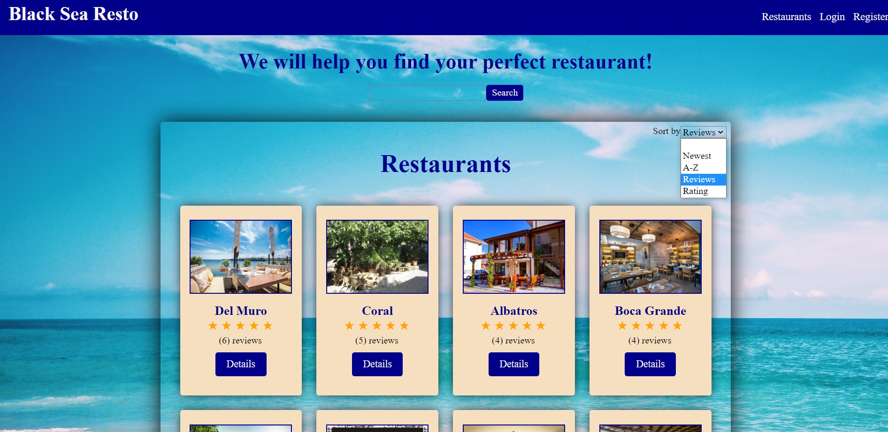
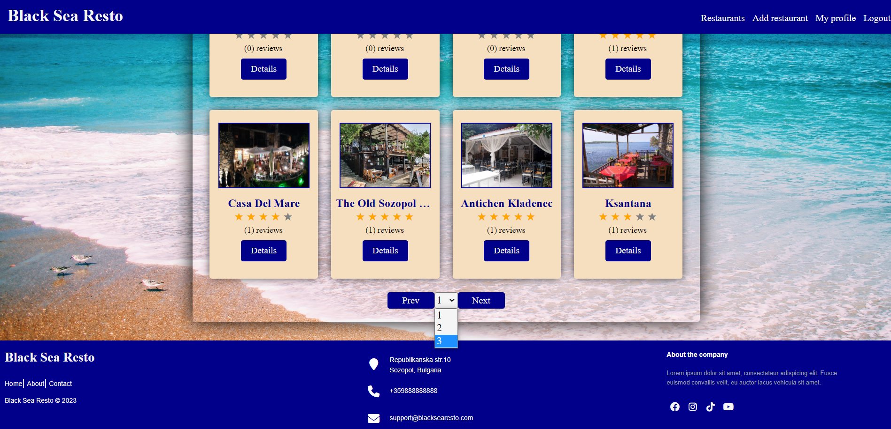
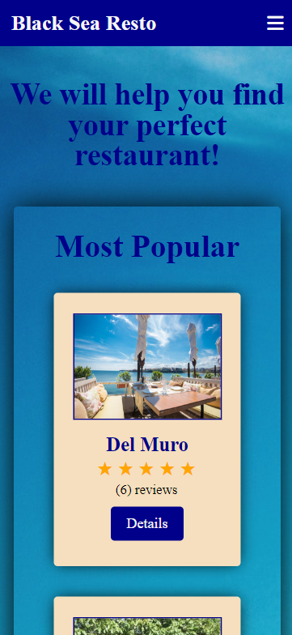
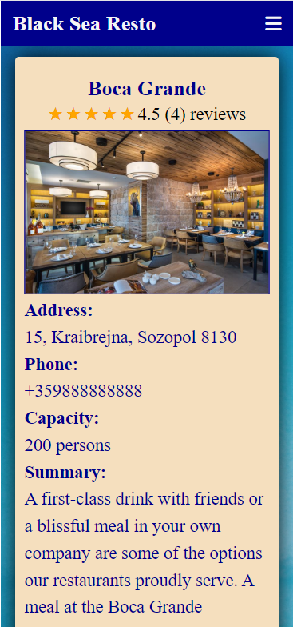
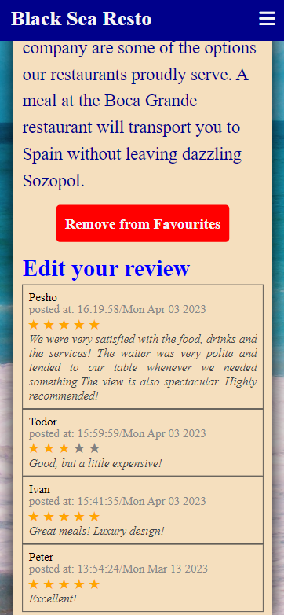
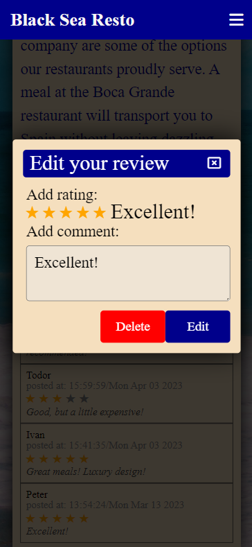
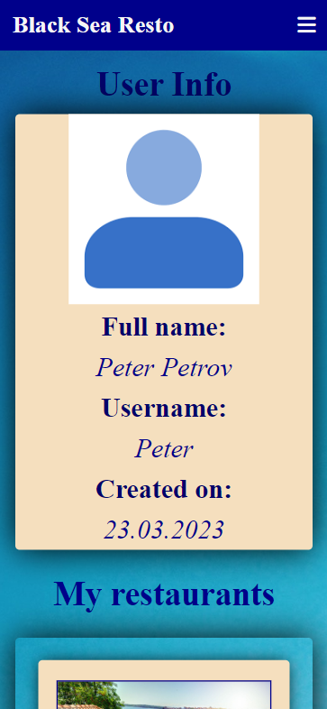
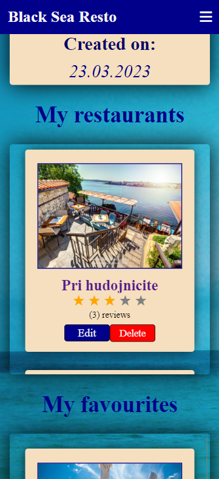

<h1 align="center"><i>Black Sea Resto</i></h1>

 Black Sea Resto is an app which introduce the restaurants located on Bulgarian Black Sea! Users can see details about every restaurant also can check reviews left by other users.
Also every registered user can upload own restaurant and attract future visitors.

    
    

    
    

    
    

    
    

    
    

    
    

    
    

    
    

    
    

    
    

    
    

    
    

    
    

    
    

    
    

**Features of the app**

<b>Home page with three most popular restaurants, last added restaurant and last added review</b>

<b>Register and Login page with validations - only for logged out users</b>

<b>Restaurants page with pagination, search and sort by criteria</b>

<b>Details page</b>

- <i>Edit restaurant - only for the owner</i>
- <i>Delete restaurant - only for the owner</i>
- <i>Add to favourites/Remove from favourites - only for logged in user differnet than owner</i>
- <i>Add/Edit/Delete review - only for logged in user differnet than owner</i>

<b>Add restaurant page with validations - only for logged in users</b>

<b>My profile page - only for logged in users</b>

- <i>User info</i>
- <i>My restaurants  - with edit/delete buttons and link to details</i>
- <i>My favourites - with Remove from details button and link to details</i>
- <i>My reviews - with link to restaurant details and rating and comment</i>

<b>The repository includes only "Front-end" of the app, "Back-end" is provided by Softuni (Softuni practice server)</b>

<h2>Hosted at <a href="https://black-sea-resto.onrender.com/"/>https://black-sea-resto.onrender.com/</h2>